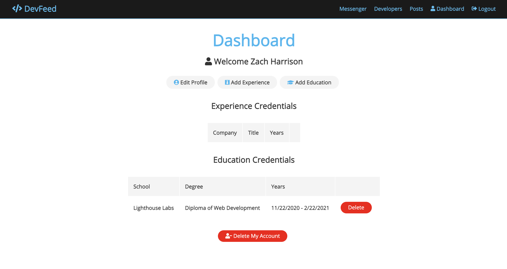
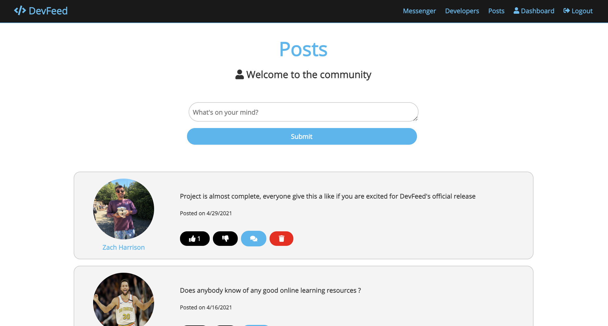
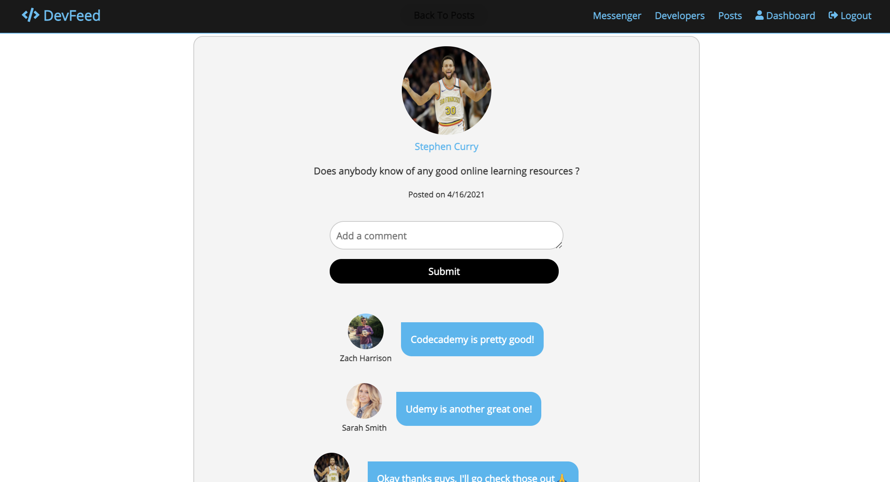
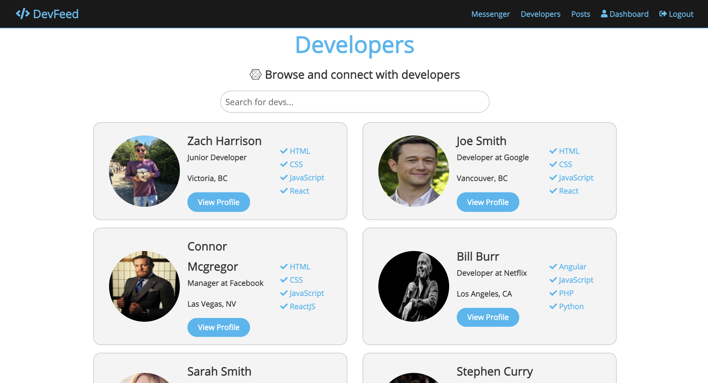
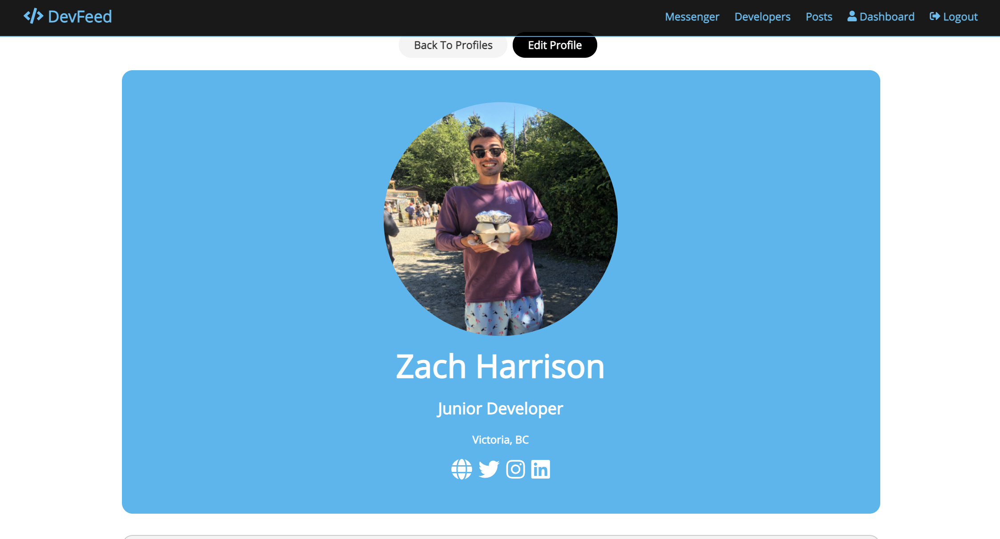
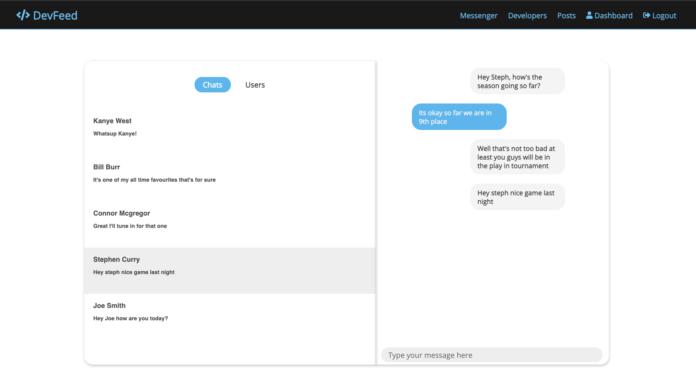

# DevFeed

> Social Network for developers built with the MERN stack, Socketio, JSON Web Token, GitHub API, Redux, and MongoDB.

[Live Demo](https://dev-feed-social.herokuapp.com/)

```
Sample User Logins

email: jsmith@gmail.com
password: password

email: ssmith@gmail.com
password: password
```

## Features

- Ability to create a profile with a custom photo, and list your experience and education as a developer
- Link to your GitHub to show off your latest repositories
- Create new posts
- Delete a post if it belongs to you
- Like & Comment on a post
- Unlike a post if you have already liked it
- find other developers in the DevFeed community with a search form to find users by name
- Chat feature to communicate with other users
- Search filter to find users by name
- Fully responsive UI

## Screenshots













---

# Get Started

### Add a default.json file in config folder with the following

```
{
  "mongoURI": "<your_mongoDB_Atlas_uri_with_credentials>",
  "jwtSecret": "secret",
  "githubToken": "<yoursecrectaccesstoken>"
}
```

### Install server dependencies

```bash
npm install
```

### Install client dependencies

```bash
cd client
npm install
```

### Run both Express & React from root

```bash
npm run dev
```
